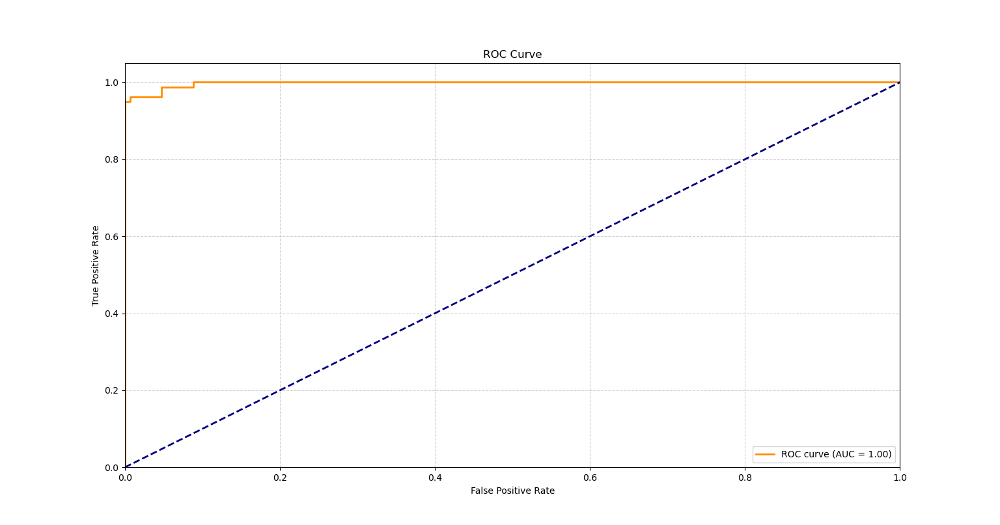
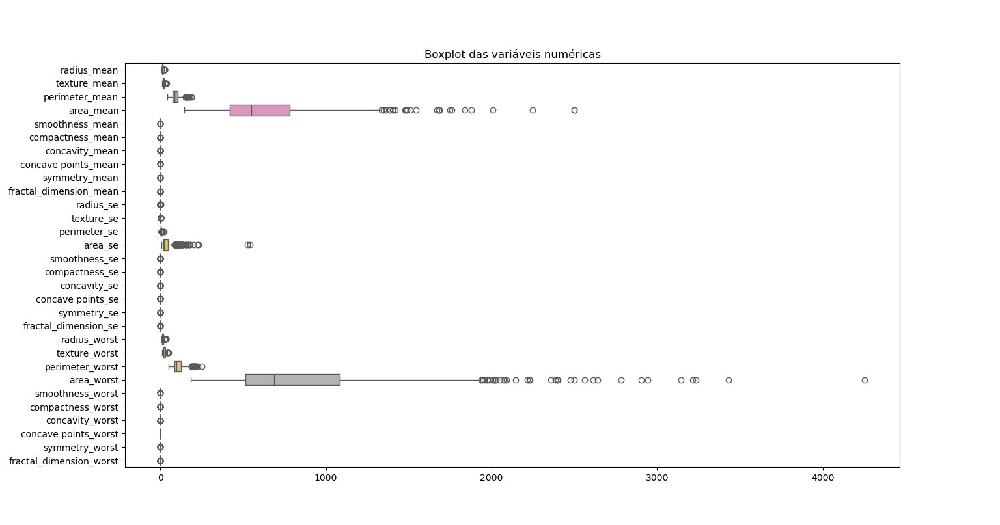

# Breast Cancer Classification

Projeto de classificação de tumores mamários benignos e malignos usando o Wisconsin Diagnostic Breast Cancer dataset. A reorganização preserva o XGBoost, o Random Forest, a escolha de threshold via precision-recall e as métricas/imagens já documentadas.

> **Uso educacional:** este modelo não é dispositivo médico e não deve ser usado para diagnóstico ou decisão clínica.

## Estrutura

```text
.
├── data/                 # dados locais (não versionados)
│   └── raw/.gitkeep
├── images/               # figuras do projeto
├── models/               # artefatos treinados (gerados localmente)
├── notebooks/            # exploração e avaliação reproduzíveis
├── reports/              # métricas e figuras geradas
├── src/breast_cancer/    # pacote Python reutilizável
├── pyproject.toml
└── README.md
```

## Configuração

Requer Python 3.10 ou superior. Crie um ambiente e instale o projeto:

```bash
python -m venv .venv
# Windows: .venv\Scripts\activate
# macOS/Linux: source .venv/bin/activate
python -m pip install -e ".[notebooks]"
```

Coloque o CSV original em `data/raw/cancer_mama.csv`. O CSV deve conter `diagnosis` (`B` benigno, `M` maligno) e os atributos do dataset. O arquivo não foi incluído neste repositório; os dados locais são ignorados pelo Git.

## Execução

Abra os notebooks em ordem:

1. `notebooks/01_analise_exploratoria.ipynb`: validação do dataset, estatísticas, classes, correlações e figuras.
2. `notebooks/02_treinamento_e_avaliacao.ipynb`: split estratificado, validação cruzada, treino dos modelos, threshold, relatório e matriz de confusão.

Execute a partir da raiz do repositório. Os notebooks salvam figuras em `reports/figures/` e modelos em `models/`.

## Método e métricas

O alvo é codificado como benigno `0` e maligno `1`. O split usa `test_size=0.4` e `random_state=42`, como na implementação original, e agora também é estratificado para manter a proporção das classes. O threshold do XGBoost é selecionado exclusivamente nas probabilidades do conjunto de treino, maximizando recall sob precisão mínima de 0.90, e então aplicado ao teste.

O relatório mantém **precision, recall, F1-score, support, accuracy, macro avg e weighted avg**, além de **AUC-ROC, matriz de confusão, curva ROC e validação cruzada**. Os valores abaixo são resultados previamente registrados no README original; como o CSV e o artefato treinado não estão versionados, eles não foram recalculados nesta reorganização.

| Métrica registrada | Valor |
|---|---:|
| Threshold | 0.119 |
| AUC-ROC | 0.998 |
| Accuracy | 0.943 |
| Recall benigno (0) | 0.912 |
| Recall maligno (1) | 1.000 |
| Precision benigno (0) | 1.000 |
| Precision maligno (1) | 0.860 |
| F1 benigno (0) | 0.954 |
| F1 maligno (1) | 0.925 |
| Matriz de confusão | `[[135, 13], [0, 80]]` |
| CV (3 folds, registrada) | `[0.9649, 0.9737, 0.9469]` |

Esses números são referência histórica, não uma garantia de reprodução. Como o split agora é estratificado, os notebooks recalculam todas as métricas com o dataset local.

## Figuras existentes

As figuras originais foram preservadas:





## Reprodutibilidade e manutenção

- Configurações do modelo e caminhos ficam centralizados no pacote `src/breast_cancer`.
- Os dados brutos, modelos, logs e resultados gerados são ignorados pelo Git; não coloque dados sensíveis no repositório.
- O XGBoost usa `random_state` explícito e o split é estratificado.
- O threshold não é escolhido no conjunto de teste.
- Para uso real, seria necessária validação externa, análise clínica e governança apropriada.
